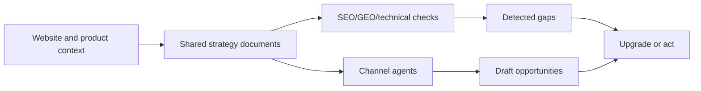

# Okara AI CMO Scout and CMO Lite Alternative

Research date: 2026-08-31  
Requested output folder: `/Users/nosensetxt/mvp/h-i`  
Target URL: https://okara.ai/agent/cmo/c2560bc7-d9df-4147-b7a2-cd898379f488

## Evidence Status

- Brave was used earlier in this task while the signed-in Okara page was accessible.
- A later attempt to re-read the same Brave tab was blocked by the browser security policy. I did not bypass it.
- The Okara functionality notes below are therefore based on the earlier logged-in Brave capture in this task, plus the public Okara homepage capture. Treat exact counts and UI state as time-specific.
- No chat message was sent, no upgrade was clicked, no Google integration was connected, and no account-changing action was taken.

## Okara Functionality Scout

The logged-in agent page showed an `AI CMO` workspace for the project `BidLadders`.

### Core Workspace

- Okara Terminal initialized the product context: "Documents loaded and CMO initialized."
- The page displayed a user badge and remaining credits.
- A `Context` panel held product data, document sources, competitors, and edit controls.
- The product description was read into the workspace and framed BidLadders as a transparent acquisition board.

### Context Inputs

Visible documents:

- Product Information
- Marketing Strategy
- `llms.txt`
- Competitor Analysis
- Design Guide
- Content Strategy

Visible competitors:

- acquire.com
- flippa.com
- empireflippers.com
- littleexits.com
- trustmrr.com
- microns.io

The important product pattern: every content or channel agent reads from the same shared context instead of inventing strategy separately.

### Analytics

Tabs visible:

- SEO
- Links
- Technical
- GEO

SEO tab:

- Mobile Lighthouse-style scores: Performance 98, Accessibility 95, Best Practices 100, SEO 100.
- Desktop scores: Performance 100, Accessibility 95, Best Practices 100, SEO 100.
- Lab metrics included LCP, FCP, TBT, and CLS with passing states.
- SEO Health flagged: missing canonical URL, no Open Graph tags, render-blocking resources, low word count, and mobile-friendly issue.

Links tab:

- Backlink/referring-domain insight was locked behind upgrade.

Technical tab:

- On-page score 96.
- Server shown as Cloudflare.
- HTTP status 200.
- Encoding `zstd`.
- Page size and DOM size about 4 KB.
- Server timing values included TTFB, DOM Complete, TTI, connection, TLS, and download.
- Content relevance showed title relevance, description relevance, keyword relevance, and content rate.

GEO tab:

- GEO checklist showed 5/10.
- Signals covered structured data, meta description, heading structure, content depth, canonical URL, robots.txt, `llms.txt`, sitemap.xml, language attribute, and readability.
- Site files showed robots.txt found, `llms.txt` missing, sitemap.xml missing.
- AI mentions, competitor visibility, and keyword insights were locked.

### Agent Feed

Visible agents or opportunities:

- X Influencer Agent
- Reddit Agent
- GEO Agent
- SEO Agent
- X Agent
- Articles Agent
- LinkedIn Agent
- UGC Videos Agent

The agent feed mixes real observations, draft/action opportunities, and upgrade pressure. It creates the feeling of an always-on marketing department even when many details are locked.

### Chat and Controls

Visible chat capabilities:

- New chat
- Chat history
- Minimize chat
- Integrations
- Attach file
- Mention
- Prompt suggestions for 30-day strategy, target customer, competitors, positioning, one-liner, and organic traffic.

Visible management controls:

- Add context files
- Edit competitors
- Setup Pulse
- Move/minimize panels
- Drag-to-reorder and drag-to-archive agents
- Upgrade and Hire Now calls to action

## What Okara Is Really Selling

Okara is not only selling content generation. It sells the emotional state of "a CMO is watching everything." The product combines:

- Shared strategic memory.
- Automated audit diagnostics.
- Channel-specific agent opportunities.
- Locked insights that imply deeper value.
- A paid upgrade path framed as hiring an AI CMO.

The working loop is:



## Idea Generator Output: Low-Tier Alternative

Mutation level used: Medium.  
Hard constraints: cheaper than Okara, correlated with the same outcome, lower operational cost, no fake autopilot, human approval before external action.

### Parent A: Okara-Style AI CMO

- Target: founders and small teams with weak marketing capacity.
- Function: centralize context, audit gaps, create agent opportunities.
- Value: relief, speed, perceived CMO coverage.
- Cost driver: many channels, live integrations, always-on agent UX.

### Parent B: Evidence-Led Weekly Operating Console

- Target: cost-sensitive founders who need prioritization more than full automation.
- Function: crawl, score, rank, draft, approve, measure.
- Value: trust, focus, lower spend.
- Cost driver: scheduled batch work, BYO keys, fewer channels.

## Idea 1 - CMO Lite Evidence Console

One-sentence overview: A weekly AI marketing console that audits the site, reads public signals, ranks 5-7 actions, drafts only the top items, and requires human approval before publishing.

### Concept

CMO Lite keeps the strongest Okara correlation: shared context plus action generation. It removes high-cost always-on agents and replaces them with a weekly evidence loop. The user sees what was checked, why an action matters, what draft is ready, and what outcome should be measured next week.

### Why It Is Interesting

It gives the same practical marketing pressure as Okara but with less cost and less trust risk. The buyer is not paying for "AI CMO theater"; they pay for a repeatable decision rhythm.

### DNA

- Target <- Parent A: small teams wanting CMO leverage.
- Operating cadence <- Parent B: weekly evidence batch.
- Value <- Mutation: "autopilot" becomes "proof-led operating rhythm."
- Constraint/Lock <- human approval before external action.

## Idea 2 - GEO Fix Pack Generator

One-sentence overview: A narrow tool that audits citation-readiness and generates exact files or tickets for `llms.txt`, sitemap, schema, canonical URL, and content depth.

### Concept

Instead of selling a whole CMO, this sells one painful Okara-discovered job: become easier for search engines and LLMs to cite. It scans the site, creates a plain fix pack, and explains each fix in business terms.

### Why It Is Interesting

It can be sold cheaply because the scope is narrow. It also creates a natural upgrade path into the broader CMO Lite console.

### DNA

- Target <- Parent A: AI visibility concern.
- Technology <- Parent B: fixed audit checklist.
- Purpose <- Mutation: broad agent feed narrowed to deployable GEO fixes.
- Constraint/Lock <- no claim of AI mention tracking unless directly integrated.

## Idea 3 - Community Opportunity Triage

One-sentence overview: A Reddit/community listening tool that finds relevant public threads, scores fit, drafts non-spam replies, and keeps all posting manual.

### Concept

This takes Okara's Reddit Agent idea and makes it safer and cheaper. The tool does not pretend it can manufacture community trust. It finds places where the founder can answer naturally, then prepares reply drafts with evidence and tone warnings.

### Why It Is Interesting

Community growth is hard to automate safely. A low-tier tool can win by making the user better at choosing when not to post.

### DNA

- Target <- Parent A: founders needing channel opportunities.
- Method <- Parent B: evidence-ranked manual queue.
- Purpose <- Mutation: "agent posts for you" becomes "trust-preserving reply assistant."
- Constraint/Lock <- human posts manually.

## Recommended Low-Tier Product

Build `CMO Lite Evidence Console` first, with `GEO Fix Pack` and `Community Opportunity Triage` as two modules.

### MVP Modules

1. Product context intake: URL, product description, target customer, competitors, voice rules.
2. Site audit: Lighthouse/PageSpeed-style results, metadata, canonical, Open Graph, headings, word count, server hints.
3. GEO readiness: schema, `robots.txt`, `llms.txt`, sitemap, canonical, content depth, readability.
4. Community opportunity scan: Reddit/public community matches, thread fit, risk score, suggested reply angle.
5. Action queue: top 5-7 weekly actions, each with evidence, effort, expected result, and approval state.
6. Draft generator: one article brief, one social post, one community reply, one technical fix pack per week.
7. Outcome ledger: what shipped, what changed, what to repeat, what to drop.

### Cost Positioning

- Okara-style full AI CMO: broad, ambitious, many agents, more upgrade pressure.
- CMO Lite: narrower, evidence-led, cheaper, high-trust, no external action without approval.

Suggested pricing:

- Free: one site scan, 3 action cards, no history.
- Lite: USD 19-29/month, weekly scan, 5 actions, BYO AI key or capped included credits.
- Pro-lite: USD 49-79/month, 3 projects, community triage, outcome history.
- Setup pack: USD 99-199 one-time, configure context docs, competitors, GEO files, and first campaign board.

## GitHub Code Map

License requirement: MIT, Apache-2.0, or BSD/Berkeley only. The license values below were checked through the GitHub connector on 2026-08-31.

| Product part | Repository | License | Use in CMO Lite |
|---|---|---:|---|
| Site audit and PageSpeed-style checks | https://github.com/GoogleChrome/lighthouse | Apache-2.0 | Performance, accessibility, best practices, SEO diagnostics. |
| Browser automation and visual checks | https://github.com/microsoft/playwright | Apache-2.0 | Logged-in/manual test flows, screenshot checks, browser-based audit jobs. |
| Crawling and extraction orchestration | https://github.com/apify/crawlee | Apache-2.0 | Scheduled site crawl, public page extraction, queue/retry handling. |
| HTML parsing | https://github.com/cheeriojs/cheerio | MIT | Fast metadata, headings, links, Open Graph, canonical extraction. |
| Main-content extraction | https://github.com/mozilla/readability | Apache-2.0 | Extract readable body text for content-depth and clarity checks. |
| Agent/workflow orchestration | https://github.com/langchain-ai/langgraphjs | MIT | Build a simple audit -> rank -> draft -> approval graph. |
| LLM/tool integration | https://github.com/langchain-ai/langchainjs | MIT | Prompt/tool wrappers and retrieval over project context docs. |
| Reddit API integration | https://github.com/praw-dev/praw | BSD-2-Clause | Optional Reddit API route where authenticated/user-approved. |
| Dashboard app framework | https://github.com/vercel/next.js | MIT | Web application shell, routes, API endpoints, deployable dashboard. |
| UI components | https://github.com/shadcn-ui/ui | MIT | Dashboard controls, dialogs, tables, tabs, action cards. |
| Server-state data fetching | https://github.com/TanStack/query | MIT | Project scans, queued jobs, history, and optimistic approval states. |
| Action tables and triage grids | https://github.com/TanStack/table | MIT | Sortable issue/action/opportunity tables. |
| Schema.org type support | https://github.com/google/schema-dts | Apache-2.0 | JSON-LD schema generation and validation in TypeScript. |
| Sitemap generation | https://github.com/ekalinin/sitemap.js | MIT | Sitemap.xml generation for GEO fix packs. |

Avoid for this version:

- AGPL or source-available-only crawler stacks if you want clean commercial reuse.
- Auto-posting libraries as default behavior. Manual approval is a product trust advantage.
- Broad social scraping without clear platform permission and rate-limit handling.

## Sales Motion: First Offer Strategy

# Deal Strategy: CMO Lite First Sales Motion

## Deal Snapshot

- **Account:** Unknown; target buyer inferred from product: solo founders, indie hackers, small SaaS teams, marketplace operators.
- **Opportunity:** First sale of CMO Lite Evidence Console.
- **Stage:** Unknown; concept validated against Okara visible positioning, not customer discovery.
- **Close Date:** Unknown.
- **Time Window:** First 30 days after MVP demo.
- **Run Mode:** Full Strategy Pack.
- **Coverage Summary:** User-provided/product research only. No CRM, calls, email, or customer transcript evidence.

## Deal Map

- **Initiative:** Help small teams get useful marketing execution without hiring a CMO or paying for a full autopilot suite.
- **Target Outcome:** Weekly marketing actions that are evidence-backed, cheap to run, and safe to approve.
- **Current Motion:** Pre-sales or early MVP. Sell a narrow outcome first: "Your next 7 marketing actions, each backed by evidence."
- **Active Workstreams:**
  - Build a demo around one real site audit and one weekly action queue.
  - Show GEO fixes as deployable artifacts, not abstract recommendations.
  - Include one community opportunity card with "why post" and "why not post" reasoning.
  - Make approval states central to the UI.
  - Add an outcome ledger so users see what improved after action.
- **Top Blockers or Dependencies:**
  - Need proof that users value weekly focus over broader autopilot.
  - Need clear data-handling language for crawls, competitors, and community scans.
  - Need a pricing line that does not invite direct comparison to full Okara coverage.
  - Need one strong before/after demo case.

## Buying Committee Map

| Stakeholder | Title | Org | Role | Stance | Influence | Last Signal | Confidence | Source |
| --- | --- | --- | --- | --- | --- | --- | --- | --- |
| Founder/operator | Owner/CEO | Small SaaS or marketplace | economic_buyer | Inference: interested if marketing execution is stalled | high | Okara positioning suggests pain around outsourced CMO function | Medium | Okara capture |
| Marketer/contractor | Growth or content operator | Small team | influencer | Inference: supportive if it reduces research/drafting load | medium | Tool creates weekly evidence/action queue | Medium | Product inference |
| Technical owner | Founder/engineer | Small team | blocker/influencer | Inference: skeptical if tool asks for risky integrations | medium | Low-tier version avoids auto-posting and uses BYO keys | Medium | Product design |

## Procurement Risk Register

| Risk ID | Risk Summary | Risk Type | Severity | Likelihood | Owner or Suggested Owner | Mitigation | Target Date | Confidence | Source |
| --- | --- | --- | --- | --- | --- | --- | --- | --- | --- |
| R1 | Buyer sees it as weaker than Okara because it is not a full AI CMO. | Positioning | High | Medium | Founder/seller | Position as "weekly evidence console" instead of cheaper clone. | Before demo launch | Medium | Product inference |
| R2 | Community scan could feel spammy or unsafe. | Trust/compliance | High | Medium | Product owner | Keep posting manual; include "do not reply" warnings and source links. | MVP | Medium | Reddit/community module design |
| R3 | AI credit costs could make low pricing unprofitable. | Unit economics | Medium | High | Product owner | BYO key option, weekly caps, cached audit results, paid setup pack. | Pricing test | Medium | Cost model inference |
| R4 | Site audit results can be noisy or non-actionable. | Product quality | Medium | Medium | Product owner | Convert findings into ranked tasks with evidence and expected outcome. | MVP | Medium | Okara SEO/GEO capture |
| R5 | Users may not return weekly without visible progress. | Retention | High | Medium | Product owner | Add outcome ledger and "changed since last scan" view. | First paid beta | Medium | Product inference |

## Prioritized Next Actions

1. **Action:** Create a one-page demo using a real product URL and show the top 7 actions.
   - **Owner or Suggested Owner:** Product owner
   - **Due:** Before first sales calls
   - **Linked Risk IDs:** R1, R4
   - **Linked Stakeholders:** Founder/operator
   - **Expected Outcome:** Buyer understands the product in under 90 seconds.
   - **Source:** Product inference

2. **Action:** Build the GEO Fix Pack as the sharpest wedge.
   - **Owner or Suggested Owner:** Product owner
   - **Due:** MVP
   - **Linked Risk IDs:** R1, R4
   - **Linked Stakeholders:** Founder/operator, technical owner
   - **Expected Outcome:** Product produces concrete files/tickets instead of vague advice.
   - **Source:** Okara GEO capture

3. **Action:** Price the first offer as "weekly marketing evidence and action queue," not "AI CMO."
   - **Owner or Suggested Owner:** Seller
   - **Due:** First landing page
   - **Linked Risk IDs:** R1, R3
   - **Linked Stakeholders:** Founder/operator
   - **Expected Outcome:** Avoid direct feature-count comparison with Okara.
   - **Source:** Sales inference

4. **Action:** Make all external actions manual by default.
   - **Owner or Suggested Owner:** Product owner
   - **Due:** MVP
   - **Linked Risk IDs:** R2
   - **Linked Stakeholders:** Technical owner, marketer/contractor
   - **Expected Outcome:** Higher trust and less compliance risk.
   - **Source:** Product inference

5. **Action:** Add an outcome ledger from day one.
   - **Owner or Suggested Owner:** Product owner
   - **Due:** First paid beta
   - **Linked Risk IDs:** R5
   - **Linked Stakeholders:** Founder/operator
   - **Expected Outcome:** Retention story becomes visible: action, result, next action.
   - **Source:** Product inference

## Evidence Gaps

- **Gap:** No live customer interviews or call transcripts.
  - **Impact:** Buyer objections and willingness-to-pay are inferred, not proven.
  - **Smallest Next Collection Step:** Run 5 founder demos with the same real-site report and record objections.

- **Gap:** Current Brave re-read was blocked by browser policy.
  - **Impact:** Okara UI state may have changed after the earlier capture.
  - **Smallest Next Collection Step:** Re-authorize browser access or manually export screenshots/text from Brave.

## Inference Notes

- Inference: CMO Lite should win through proof and control, not by claiming equal agent breadth.
- Inference: The strongest first wedge is GEO readiness because Okara visibly surfaces concrete citation-readiness gaps.
- Inference: Community triage is valuable only if it protects trust and prevents bad posts.

## Product Design Template

Templates are reusable reference patterns. A template stores a source reference image and preview so future Product Design prompts can reuse the same structure, visual hierarchy, and intent. To use it later, add Product Design, choose the template from the Template Gallery, or tag the saved template skill directly and describe the design you want.

Created template:

- Display name: `CMO Lite Product Design`
- Skill name: `artifact-template-cmo-lite-product-design`
- Template path: `/Users/nosensetxt/.codex/skills/artifact-template-cmo-lite-product-design`
- Reference image: `/Users/nosensetxt/mvp/h-i/cmo-lite-product-design-reference.png`
- Gallery kind: `product-design`

Use it by tagging:

```text
$artifact-template-cmo-lite-product-design Create a Product Design image for a weekly AI CMO evidence dashboard for [my product].
```

## Visualize Output

Created comparison visual:

- `/Users/nosensetxt/mvp/h-i/okara-vs-cmo-lite.html`

It compares:

- Business model: broad AI CMO replacement vs narrow evidence operating cadence.
- Monetisation: locked agent capability and monthly CMO framing vs low subscription, BYO keys, setup packs, and caps.
- Emotion ecology: relief/FOMO/upgrade pressure vs control/proof/momentum.

## Files Created

- `/Users/nosensetxt/mvp/h-i/okara-cmo-lite-report.md`
- `/Users/nosensetxt/mvp/h-i/cmo-lite-product-design-reference.png`
- `/Users/nosensetxt/mvp/h-i/okara-vs-cmo-lite.html`
- `/Users/nosensetxt/.codex/skills/artifact-template-cmo-lite-product-design`

