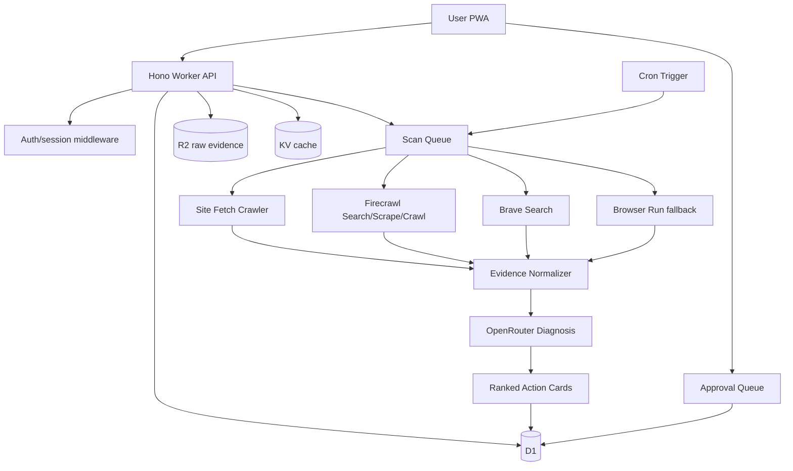

# Okara-Lite Business, UX, Tech Stack, And System Design

Last updated: 2026-09-02 HKT

## 1. Product Positioning

This app is a lite AI marketing operator inspired by Okara's public function set, not a clone of Okara's UI or brand. The product promise is:

> Give a founder a daily or weekly queue of evidence-backed marketing actions: Reddit opportunities, GEO fixes, SEO issues, content drafts, and simple distribution tasks.

The key architectural rule:

```txt
The model is not the crawler.
The Worker collects evidence.
OpenRouter interprets evidence and returns ranked action cards.
The user approves before anything is published or changed.
```

Okara's public positioning includes an AI CMO suite with agents for website analysis, SEO, GEO, Reddit, social, content, influencer, coding, LinkedIn, and UGC. The lite version should mimic the operational loop, not the full breadth:

```txt
crawl/search -> diagnose -> rank -> draft -> approve -> track outcome
```

## 2. Lite Scope

### Include In MVP

| Function | Purpose | Lite boundary |
|---|---|---|
| Website intake | Understand product, ICP, claims, pages, competitors | One website per project |
| Site crawl | Read public website evidence | Fetch + sitemap first; Firecrawl fallback |
| GEO diagnosis | Improve AI-search visibility | Schema, llms.txt, FAQ, comparison, category clarity |
| Reddit discovery | Find relevant communities and threads | Search only; no auto-posting |
| SEO diagnosis | Find basic technical/content opportunities | Title/meta/headings/canonical/sitemap/internal links |
| Content drafts | Create approval-ready snippets | Reddit replies, post angles, FAQ blocks, landing-page fixes |
| Action ranking | Sort by expected impact and risk | 5-10 cards per scan |
| Approval queue | Human reviews actions | Required for all public output |
| Outcome ledger | Track what was approved and what changed | Manual or simple metric links |
| Usage/billing | Prevent margin collapse | Hard caps by plan |

### Exclude From MVP

| Excluded | Reason |
|---|---|
| Auto-publishing to Reddit | Ban risk and trust risk |
| Full autonomous CMO | Too broad and expensive |
| UGC video generation | Separate product surface and high media cost |
| Influencer outreach automation | Legal/compliance/reputation risk |
| GitHub PR coding agent | Can come later as a Pro add-on |
| Deep research agents by default | Unpredictable cost |

## 3. Business Model

### Pricing Ladder

| Plan | Price | Included |
|---|---:|---|
| Free scan | $0 | 1 site, 1 limited scan, 3 action cards |
| Starter | $19/mo | Weekly scan, 1 site, 10 action cards/month |
| Operator | $49/mo | Daily light scan, 1 site, 60 action cards/month |
| Pro | $99/mo | Daily deeper scan, 3 sites, competitor tracking |
| Agency | $199+/mo | Multi-client workspace, client reports, higher quotas |

### Provider Cost Allocation

Start with free tiers:

| Provider | Free use | Paid role |
|---|---|---|
| Firecrawl | 1,000 credits/month | Scrape/crawl/map evidence |
| Brave Search | $5/month credits, around 1,000 searches | Broad search and Reddit discovery |
| Exa | signup/monthly free credits | Semantic discovery and competitor finding |
| Tavily | 1,000 credits/month | Backup/simple MVP path only |
| OpenRouter | model usage | Diagnosis, ranking, drafting |

After 50 paying users, fund providers from subscription revenue:

```txt
60% Firecrawl
30% Brave Search
10% Exa experiments
0% Tavily unless it replaces engineering time
```

### Quota Rules

| Plan | Site fetch pages | Search queries | Scraped external URLs | AI action cards |
|---|---:|---:|---:|---:|
| Free | 10 once | 2 once | 3 once | 3 |
| Starter | 25/week | 3/week | 6/week | 10/mo |
| Operator | 10/day | 3/day | 5/day | 60/mo |
| Pro | 40/day | 8/day | 15/day | 200/mo |

Hard caps are mandatory. No user should trigger unlimited Firecrawl, search, Browser Run, or model calls.

## 4. UX Design

### Primary UX Principle

The app should not feel like a chatbot. It should feel like a daily marketing workbench.

```txt
Today -> Evidence -> Actions -> Draft -> Approve -> Outcome
```

### Mobile PWA Navigation

| Tab | Main screen | User action |
|---|---|---|
| Today | Ranked action cards | Approve, edit, dismiss |
| Scan | Site status and crawl evidence | Run scan, see failures |
| Reddit | Subreddits, threads, draft replies | Review rule fit and approve draft |
| GEO | AI-search visibility issues | Apply copy/schema/content fixes |
| Reports | Weekly summary and outcome ledger | Export or send report |

### Core Screens

#### Onboarding

Fields:

```txt
website URL
product category
ICP
target geography
competitors
brand voice
blocked topics
allowed communities
approval preference
```

UX output:

```txt
Project context document
Initial crawl result
First 3 ranked actions
```

#### Today Queue

Each card must show:

```txt
priority
source evidence
diagnosis
recommended action
draft
risk
approval button
```

No card should exist without at least one evidence URL or internal site finding.

#### Evidence Drawer

User can inspect:

```txt
fetched site page
search result
Firecrawl markdown excerpt
Reddit thread URL
schema/llms.txt/sitemap check
model reasoning summary
```

Do not show hidden chain-of-thought. Show source-backed explanation.

## 5. Recommended Tech Stack

| Layer | Choice | Reason |
|---|---|---|
| Frontend | React + Vite PWA | Fast mobile workbench |
| API | Hono on Cloudflare Workers | Small, fast Worker API |
| Auth | Clerk/Auth.js/custom email magic link | Keep identity simple |
| Database | Cloudflare D1 | Projects, scans, actions, quotas |
| Raw artifacts | Cloudflare R2 | Raw crawl/search snapshots |
| Cache | Cloudflare KV | Sitemap cache, query cache, provider response hashes |
| Async jobs | Cloudflare Queues | Scan pipeline, retries, rate control |
| Schedules | Cloudflare Cron Triggers | Daily/weekly scans |
| Long workflows | Cloudflare Workflows | Multi-step scans that can resume |
| JS rendering | Cloudflare Browser Run/Puppeteer | Only for JS-heavy pages |
| Search | Brave Search first | Broad, predictable web/reddit discovery |
| Crawl/extract | Firecrawl | Clean markdown, map, crawl, scrape |
| Semantic search | Exa optional | Fuzzy competitor/community discovery |
| AI model | OpenRouter | Flexible model routing and cost control |
| Billing | Stripe | Subscription, usage caps, webhooks |
| Observability | Workers logs + Sentry/Logtail optional | Job failures and cost tracing |

## 6. High-Level Architecture



## 7. Data Model

### Tables

```sql
CREATE TABLE users (
  id TEXT PRIMARY KEY,
  email TEXT NOT NULL UNIQUE,
  role TEXT NOT NULL DEFAULT 'user',
  created_at TEXT NOT NULL
);

CREATE TABLE workspaces (
  id TEXT PRIMARY KEY,
  owner_user_id TEXT NOT NULL,
  name TEXT NOT NULL,
  plan TEXT NOT NULL DEFAULT 'free',
  created_at TEXT NOT NULL
);

CREATE TABLE workspace_members (
  workspace_id TEXT NOT NULL,
  user_id TEXT NOT NULL,
  role TEXT NOT NULL,
  PRIMARY KEY (workspace_id, user_id)
);

CREATE TABLE projects (
  id TEXT PRIMARY KEY,
  workspace_id TEXT NOT NULL,
  site_url TEXT NOT NULL,
  product_category TEXT,
  icp TEXT,
  target_geo TEXT,
  competitors_json TEXT NOT NULL DEFAULT '[]',
  brand_voice_json TEXT NOT NULL DEFAULT '{}',
  created_at TEXT NOT NULL
);

CREATE TABLE scans (
  id TEXT PRIMARY KEY,
  project_id TEXT NOT NULL,
  status TEXT NOT NULL,
  scan_type TEXT NOT NULL,
  provider_cost_json TEXT NOT NULL DEFAULT '{}',
  error TEXT,
  created_at TEXT NOT NULL,
  completed_at TEXT
);

CREATE TABLE evidence_sources (
  id TEXT PRIMARY KEY,
  scan_id TEXT NOT NULL,
  source_type TEXT NOT NULL,
  url TEXT,
  title TEXT,
  excerpt TEXT,
  r2_key TEXT,
  content_hash TEXT NOT NULL,
  created_at TEXT NOT NULL
);

CREATE TABLE actions (
  id TEXT PRIMARY KEY,
  scan_id TEXT NOT NULL,
  project_id TEXT NOT NULL,
  type TEXT NOT NULL,
  priority TEXT NOT NULL,
  score REAL NOT NULL,
  confidence REAL NOT NULL,
  evidence_json TEXT NOT NULL,
  diagnosis TEXT NOT NULL,
  recommended_action TEXT NOT NULL,
  draft TEXT,
  risk TEXT,
  status TEXT NOT NULL DEFAULT 'pending',
  approval_required INTEGER NOT NULL DEFAULT 1,
  created_at TEXT NOT NULL
);

CREATE TABLE usage_events (
  id TEXT PRIMARY KEY,
  workspace_id TEXT NOT NULL,
  provider TEXT NOT NULL,
  units INTEGER NOT NULL,
  cost_estimate_usd REAL,
  event_type TEXT NOT NULL,
  created_at TEXT NOT NULL
);
```

## 8. Function System Design

### 8.1 Auth

Purpose:

```txt
Identify the user and protect projects, scans, evidence, actions, and billing.
```

MVP options:

```txt
Clerk = fastest
Auth.js = flexible
Custom magic link = cheapest but more security work
```

Required behavior:

```txt
email verification
secure HttpOnly session cookie
CSRF/origin checks for mutations
rate-limited login
generic auth errors
session rotation after login
logout invalidates session
```

### 8.2 Authorization

Roles:

| Role | Access |
|---|---|
| owner | billing, members, all project actions |
| admin | manage projects and scans |
| editor | edit drafts and approve actions |
| viewer | read reports only |

Every query must include workspace ownership or membership checks:

```ts
await assertWorkspaceRole(env, userId, workspaceId, ["owner", "admin"]);
```

Never trust a `project_id`, `scan_id`, or `action_id` from the client without verifying it belongs to the current workspace.

### 8.3 Project Intake

Inputs:

```txt
site_url
category
ICP
competitors
target regions
brand voice
blocked claims
allowed channels
```

Output:

```txt
project_context.json
first_scan queued
quota reservation
```

System steps:

```txt
validate URL
normalize domain
reject private IP/internal hostnames
store project
enqueue initial_scan
```

Security:

```txt
block localhost/private network SSRF
allow only http/https
follow redirect limit
store final URL
```

### 8.4 Own-Site Crawler

Cheap default crawler:

```txt
fetch robots.txt
fetch sitemap.xml
fetch homepage
fetch selected internal pages
parse title/meta/headings/schema/canonical/internal links
```

Use Browser Run only when:

```txt
HTML body is empty
content requires JS hydration
visual screenshot is needed
static fetch fails but browser succeeds
```

Output:

```json
{
  "pages": [
    {
      "url": "https://site.com/pricing",
      "status": 200,
      "title": "Pricing",
      "meta_description": "...",
      "h1": "...",
      "schema_types": ["SoftwareApplication"],
      "excerpt": "..."
    }
  ]
}
```

### 8.5 Firecrawl Integration

Use Firecrawl for:

```txt
search when you want result content
scrape when URL is known
crawl when a site audit needs many pages
map when only URL discovery is needed
```

Worker wrapper:

```ts
async function firecrawlSearch(env, query, limit = 10) {
  const res = await fetch("https://api.firecrawl.dev/v2/search", {
    method: "POST",
    headers: {
      Authorization: `Bearer ${env.FIRECRAWL_API_KEY}`,
      "Content-Type": "application/json"
    },
    body: JSON.stringify({
      query,
      limit,
      sources: ["web"],
      country: "US",
      safe: true,
      scrapeOptions: { formats: [{ type: "markdown" }] }
    })
  });

  if (!res.ok) throw new Error(`Firecrawl failed: ${res.status}`);
  return res.json();
}
```

Store:

```txt
result URL/title/description in D1
raw markdown/html snapshot in R2 when needed
creditsUsed in usage_events
```

### 8.6 Brave Search Integration

Use Brave for:

```txt
cheap broad discovery
Reddit/domain-filtered queries
fresh SERP-style result lists
LLM context endpoint if you want condensed grounding
```

Example queries:

```txt
site:reddit.com/r/SaaS "marketing automation" "recommend"
site:reddit.com "Okara AI" alternative
"AI CMO" "Reddit"
"best {category} tools"
```

Do not scrape Brave result pages. Use the API.

### 8.7 Exa Integration

Use Exa for:

```txt
semantic competitor discovery
similar companies
fuzzy problem-language search
less keyword-dependent exploration
```

Keep Exa optional until search quality becomes a bottleneck.

### 8.8 GEO Diagnosis

Deterministic checks:

```txt
llms.txt present
sitemap present
robots readable
Product/SoftwareApplication schema
FAQ schema
clear category language
comparison pages
alternative pages
pricing page clarity
use-case pages
founder/company proof
canonical URLs
AI-citable summaries
```

External checks:

```txt
search for brand/category
search for competitors
search Reddit pain language
compare snippets against site claims
identify missing answer-engine citations
```

AI prompt role:

```txt
Given these site findings and external results, identify GEO gaps and produce fixes backed by evidence URLs.
```

### 8.9 Reddit Discovery

Goal:

```txt
Find communities and conversations where the product can contribute without spam.
```

Inputs:

```txt
ICP
product category
pain points
competitors
target geography
blocked topics
```

Outputs:

```txt
subreddit candidates
thread candidates
rules/risk summary
draft replies
post angle ideas
approval-required cards
```

Ranking signals:

```txt
topic fit
freshness
community activity
rule risk
promotion sensitivity
buyer intent
evidence strength
```

Do not auto-post. Draft only.

### 8.10 SEO Diagnosis

Checks:

```txt
title/meta duplication
missing H1
weak page intent
thin pricing/docs/use-case pages
missing internal links
broken links
missing canonical
sitemap coverage
robots blocks
slow/render-heavy pages
missing schema
competitor keyword gaps
```

Lite output:

```txt
technical fix cards
content gap cards
landing page rewrite cards
internal linking suggestions
```

### 8.11 Content Drafting

Draft types:

```txt
Reddit reply
Reddit post outline
FAQ block
landing-page hero rewrite
comparison page outline
blog brief
X/LinkedIn post optional later
```

Rules:

```txt
must cite evidence
must fit brand voice
must disclose ownership when product is mentioned
must include risk note
must require approval
```

### 8.12 Action Ranking

Score:

```txt
score = impact * confidence - effort - risk
```

Recommended fields:

```json
{
  "type": "reddit_opportunity",
  "priority": "high",
  "score": 87,
  "confidence": 0.78,
  "evidence_urls": ["https://..."],
  "diagnosis": "...",
  "recommended_action": "...",
  "draft": "...",
  "risk": "...",
  "approval_required": true
}
```

### 8.13 OpenRouter Diagnosis

Use OpenRouter after evidence normalization.

Request shape:

```ts
const res = await fetch("https://openrouter.ai/api/v1/chat/completions", {
  method: "POST",
  headers: {
    Authorization: `Bearer ${env.OPENROUTER_API_KEY}`,
    "Content-Type": "application/json"
  },
  body: JSON.stringify({
    model: env.OPENROUTER_MODEL,
    messages: [
      {
        role: "system",
        content: [
          "You are a lite AI CMO.",
          "Use only the provided evidence.",
          "Return strict JSON.",
          "Every action must include evidence URLs or site checks."
        ].join("\n")
      },
      {
        role: "user",
        content: JSON.stringify({ project, evidence })
      }
    ],
    response_format: {
      type: "json_schema",
      json_schema: {
        name: "cmo_lite_actions",
        strict: true,
        schema: {
          type: "object",
          properties: {
            actions: {
              type: "array",
              items: {
                type: "object",
                properties: {
                  type: { type: "string" },
                  priority: { type: "string" },
                  score: { type: "number" },
                  confidence: { type: "number" },
                  evidence_urls: { type: "array", items: { type: "string" } },
                  diagnosis: { type: "string" },
                  recommended_action: { type: "string" },
                  draft: { type: "string" },
                  risk: { type: "string" },
                  approval_required: { type: "boolean" }
                },
                required: [
                  "type",
                  "priority",
                  "score",
                  "confidence",
                  "evidence_urls",
                  "diagnosis",
                  "recommended_action",
                  "draft",
                  "risk",
                  "approval_required"
                ],
                additionalProperties: false
              }
            }
          },
          required: ["actions"],
          additionalProperties: false
        }
      }
    }
  })
});
```

### 8.14 Approval Queue

Statuses:

```txt
pending
approved
edited
dismissed
published_manual
applied
failed
expired
```

Actions:

```txt
edit draft
approve
dismiss
copy
export
mark applied
request regeneration
```

All external posts and site changes require human approval.

### 8.15 Billing And Usage Metering

Meter:

```txt
Firecrawl credits
Brave requests
Exa requests
OpenRouter input tokens
OpenRouter output tokens
Browser Run minutes
D1/R2 storage
queue retries
```

Billing guard:

```txt
estimate cost before job
reserve quota
run job
record provider usage
settle actual usage
stop if plan cap exceeded
```

Do not hide usage behind vague credits. Internally track real provider units.

### 8.16 Security

Minimum controls:

```txt
SSRF protection for crawls
domain allowlist for project-owned scans
robots.txt respect policy
private API keys only in Worker secrets
no provider keys in frontend
workspace authorization on every row
rate limiting by user/workspace/IP
structured output validation
HTML/markdown sanitization before display
audit log for approvals
encrypted-at-rest provider data where supported
R2 private bucket
short-lived signed URLs for raw evidence
webhook signature verification
```

Sensitive data:

```txt
API keys
billing customer IDs
workspace membership
raw crawl snapshots
private strategy notes
drafts before approval
```

### 8.17 Recovery And Reliability

Failure cases:

| Failure | Recovery |
|---|---|
| Firecrawl timeout | Retry with lower limit; fall back to search-only |
| Brave rate limit | Backoff and use cache |
| OpenRouter invalid JSON | Retry once with repair prompt; otherwise mark failed |
| Crawl blocked | Store blocked evidence; suggest manual URL upload |
| Browser Run failure | Fall back to static fetch |
| Queue crash | Cloudflare Queue retry + dead letter queue |
| Billing webhook failure | Idempotency key + replay endpoint |
| D1 write failure | Retry transaction; keep raw result in R2 |

Job state machine:

```txt
queued -> acquiring -> normalizing -> diagnosing -> ranking -> ready
queued -> acquiring -> failed_retryable -> queued
queued -> acquiring -> failed_final
```

### 8.18 Observability

Log per scan:

```txt
scan_id
workspace_id
provider calls
provider latency
credits/tokens
source count
action count
failure reason
retry count
model id
cache hit/miss
```

Dashboard metrics:

```txt
cost per scan
actions generated per scan
approval rate
dismissal reason
provider failure rate
revenue per workspace
gross margin per plan
```

## 9. API Surface

```txt
POST   /api/auth/login
POST   /api/auth/logout
GET    /api/me

POST   /api/workspaces
GET    /api/workspaces/:id
POST   /api/workspaces/:id/members

POST   /api/projects
GET    /api/projects/:id
PATCH  /api/projects/:id
DELETE /api/projects/:id

POST   /api/projects/:id/scans
GET    /api/scans/:id
GET    /api/projects/:id/scans

GET    /api/scans/:id/evidence
GET    /api/projects/:id/actions
PATCH  /api/actions/:id
POST   /api/actions/:id/approve
POST   /api/actions/:id/dismiss
POST   /api/actions/:id/regenerate

GET    /api/projects/:id/reports/weekly
GET    /api/workspaces/:id/usage
POST   /api/billing/checkout
POST   /api/billing/webhook
```

## 10. Worker Scan Pipeline

```ts
async function runScan(scanId: string, env: Env) {
  const scan = await loadScanWithProject(scanId, env);
  await assertQuota(scan.workspaceId, "scan", env);

  await markScan(scanId, "acquiring", env);

  const ownSite = await crawlOwnSite(scan.project.siteUrl, env);
  const searchQueries = buildQueries(scan.project);
  const searchResults = await runBoundedSearch(searchQueries, env);
  const scraped = await scrapeTopResults(searchResults, env);

  await markScan(scanId, "normalizing", env);
  const evidence = normalizeEvidence({ ownSite, searchResults, scraped });
  await persistEvidence(scanId, evidence, env);

  await markScan(scanId, "diagnosing", env);
  const ai = await diagnoseWithOpenRouter(scan.project, evidence, env);
  const actions = validateActionSchema(ai);

  await markScan(scanId, "ranking", env);
  const ranked = rankActions(actions);
  await persistActions(scanId, ranked, env);

  await markScan(scanId, "ready", env);
}
```

## 11. Launch Plan

### Phase 1: Internal Prototype

Build:

```txt
project intake
manual scan button
own-site fetch crawler
Firecrawl search/scrape wrapper
OpenRouter structured action cards
D1 storage
Today queue
```

### Phase 2: Paid Beta

Add:

```txt
Stripe subscriptions
plan quotas
weekly cron scans
Brave search
approval audit log
weekly report
usage dashboard
```

### Phase 3: Differentiation

Add:

```txt
Exa semantic discovery
GEO prompt tracking
competitor monitoring
agency workspaces
Browser Run fallback
CMS exports
GitHub PR add-on
```

## 12. Sources

- Okara pricing and public function set: https://okara.ai/pricing
- Okara agent suite: https://okara.ai/agent
- Okara AI CMO explanation: https://okara.ai/blog/introducing-okara-ai-cmo
- Firecrawl API: https://docs.firecrawl.dev/api-reference/v2-introduction
- Firecrawl pricing: https://www.firecrawl.dev/pricing
- Brave Search API: https://brave.com/search/api/
- Exa pricing: https://exa.ai/pricing?tab=api
- Tavily pricing: https://docs.tavily.com/documentation/api-credits
- OpenRouter tool calling: https://openrouter.ai/docs/guides/features/tool-calling
- OpenRouter web search: https://openrouter.ai/docs/guides/features/server-tools/web-search
- OpenRouter structured outputs: https://openrouter.ai/docs/guides/features/structured-outputs
- Cloudflare Cron Triggers: https://developers.cloudflare.com/workers/configuration/cron-triggers/
- Cloudflare Queues: https://developers.cloudflare.com/queues/
- Cloudflare Browser Run Puppeteer: https://developers.cloudflare.com/browser-run/puppeteer/

